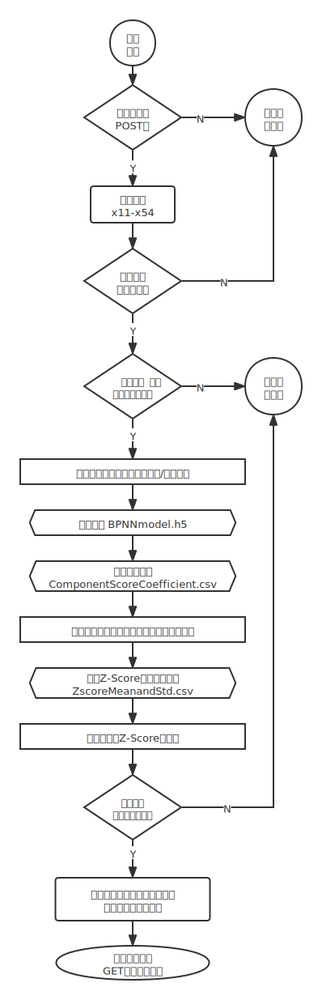

# 网站搭建与部署

得到BP神经网络模型后，我们搭建了可以预测互联网企业财务危机和风险分析的网站。

**网址为：**http://eco.sylvanding.online

**您也可以扫描下方二维码访问：**


网站使用`Flask`和`bootstrap5`框架开发，基本实现了财务危机预测的功能，采用`uWSGI`+`Nginx`部署方案，撰写了可行性研究分析报告与项目开发计划、需求分析报告、测试分析报告、软件工程文档等。我们还在GitHub上发布了项目代码，部署了演示页面，利用`docsify`生成了完整的开发文档。您可以在网站底部提供的链接中找到这些内容。

## 财务危机的分级

**我们将财务状况划分为3类，每种结果我们用不同的颜色进行数据可视化：**

* 当分数在99-70之间时，企业的财务状况良好；
* 当分数在69-40之间时，企业有潜在的财务风险；
* 当分数在39-0之间时，企业存在严重的财务风险。

## predict接口

`/predict`表单提交接口接收`GET`和`POST`请求。收到GET请求时重定向到网站主页，收到POST请求时则进行数据处理和结果预测。

### GET

`return redirect('/')`

### POST

检测POST提交的数据是否均为数字，使用 `is_number`函数，返回`True`则是数字，返回`False`则不是数字。当检测到提交内容存在非数据项时，重定向到网站主页；

```python
from flask import Flask, request, redirect, url_for
from res_info import *
import model_pred
app = Flask(__name__)
@app.route('/predict', methods=['GET', 'POST'])
def predict_pro():
    if request.method == 'GET':
        return redirect('/')
    for i in request.form.values():
        if not is_number(i):
            return redirect('/')
    try:
        form_data = dict(request.form)
        form_data = model_pred.order_param(form_data)
        if form_data is None:
            raise Exception('Data posted is illegal!')
        form_data['score'] = model_pred.predictFinRisk(list(form_data.values()))
        return redirect(url_for('index_page', **form_data) + '#result_mod')
    except Exception as e:
        return str(e)
```

```python
def is_number(s):
    try:
        float(s)
        return True
    except ValueError:
        pass
    try:
        import unicodedata
        unicodedata.numeric(s)
        return True
    except (TypeError, ValueError):
        pass
    return False
```

在网站中填写企业相关数据后，点击底部 `Start your prediction & analysis!` 按钮，向 `/predict`接口提交表单，其路由将调用`model_pred.py`模块下的`predictFinRisk`. 

```python
# -*- coding: utf-8 -*-
import warnings
import numpy as np
from tensorflow.keras.models import load_model
warnings.simplefilter(action='ignore', category=Warning)
def predictFinRisk(fin_ind):
    """
    Predict a company's financial risk according to its indexes.
    :param fin_ind: financial indexes
    :return: the probability to be at a great financial condition
    """
    # load model
    model_path = 'BPNNmodel.h5'
    model = load_model(model_path)
    # calculate factor scores
    component_path = 'ComponentScoreCoefficient.csv'
    coefficient = np.loadtxt(component_path, dtype=np.float, delimiter=',')
    factors = np.dot(np.asarray(fin_ind), coefficient)
    # Z-score the factors
    zscore_path = 'ZscoreMeanandStd.csv'
    zscore = np.loadtxt(zscore_path, dtype=np.float, delimiter=',')
    factors = (factors - zscore[0, :]) / zscore[1, :]
    # predict probability
    probability = model.predict(factors.reshape(1,-1))
    return probability[0][1]*100
```

`order_param` 函数完成对提交数据（x11-x54）的格式转换、范围和顺序的检验工作。若提交数据的范围超出 `condition` 变量规定的范围，则抛出异常。在格式转化过程中，若格式转换出现错误，则返回None。特别的，对 x52、x53、x54 整数化（因为其只能取整数）。最后，返回按 x11-x54 排序拍好的数据字典。

```python
def order_param(multiForm: dict):
    condition = (('x11', (-9999999, 999999999)),
                 ('x12', (-9999999, 999999999)),
                 ('x13', (-9999999, 999999999)),
                 ('x14', (-9999999, 999999999)),
                 ('x15', (-9999999, 999999999)),
                 ('x21', (-9999999, 999999999)),
                 ('x22', (-9999999, 999999999)),
                 ('x23', (-9999999, 999999999)),
                 ('x24', (-9999999, 999999999)),
                 ('x25', (-9999999, 999999999)),
                 ('x31', (-9999999, 999999999)),
                 ('x32', (-9999999, 999999999)),
                 ('x41', (-9999999, 999999999)),
                 ('x42', (-9999999, 999999999)),
                 ('x43', (-9999999, 999999999)),
                 ('x44', (-9999999, 999999999)),
                 ('x45', (-9999999, 999999999)),
                 ('x51', (-9999999, 999999999)),
                 ('x52', (0, 2)),
                 ('x53', (0, 2)),
                 ('x54', (0, 1)))
    ordered = {}
    for i in condition:
        try:
            d = float(multiForm['form_'+i[0]])
            if i[1][0] <= d <= i[1][1]:
                ordered[i[0]] = d
            else:
                raise Exception
        except:
            return None
    for i in range(1, 4):
        ordered[condition[-i][0]] = int(ordered[condition[-i][0]])
    return ordered
```

最后，如果提交的数据信息格式均正确，则将经过模型预测的数据和结果以GET请求重定向到首页。`return redirect(url_for('index_page', **form_data) + '#result_mod')`. 

### 程序流程图



## 接口调试

接口调试使用`postman`工具，主要对 `\predict`接口进行调试。

`\predict`**接口接收的参数、类型和范围：**

<table>
<thead>
  <tr>
    <th>KEY</th>
    <th>TYPE</th>
    <th>RANGE</th>
  </tr>
</thead>
<tbody>
  <tr>
    <td>form_x11</td>
    <td rowspan="4">float</td>
    <td rowspan="4">[-9999999, 999999999]</td>
  </tr>
  <tr>
    <td>form_x12</td>
  </tr>
  <tr>
    <td>...</td>
  </tr>
  <tr>
    <td>form_x51</td>
  </tr>
  <tr>
    <td>form_x52</td>
    <td rowspan="3">int</td>
    <td>[0, 2]</td>
  </tr>
  <tr>
    <td>form_x53</td>
    <td>[0, 2]</td>
  </tr>
  <tr>
    <td>form_x54</td>
    <td>[0, 1]</td>
  </tr>
</tbody>
</table>

**测试用例设计如下：**

<table>
<thead>
  <tr>
    <th>分类</th>
    <th>用例设计</th>
    <th>用例说明</th>
    <th>预期输出</th>
  </tr>
</thead>
<tbody>
  <tr>
    <td rowspan="2">有效等价类</td>
    <td>用例按序输入，且均落入范围内</td>
    <td>有效的有序输入</td>
    <td rowspan="2">输出结果</td>
  </tr>
  <tr>
    <td>用例不按序输入，且均落入范围内</td>
    <td>有效的无序输入</td>
  </tr>
  <tr>
    <td rowspan="4">无效等价类</td>
    <td>form_x12=err</td>
    <td rowspan="2">类型异常</td>
    <td rowspan="2">重定向</td>
  </tr>
  <tr>
    <td>form_x12=--1</td>
  </tr>
  <tr>
    <td>form_x12=1000000000</td>
    <td rowspan="2">范围异常，边缘检测</td>
    <td rowspan="2">错误输出</td>
  </tr>
  <tr>
    <td>form_x53=-1</td>
  </tr>
</tbody>
</table>

## 404页

```python
@app.errorhandler(404)
def page_not_found(e):
    return redirect(url_for('index_page'))
```

## 致谢

### JS

网页开发中使用的JS函数和作者信息：

|               Project | Version                | Author      | Site                                                     |
| -------------------- | ---------------------- | ----------- | ---------------------------------------------------------- |
| Circular Progress Bar | 1.1.5 (November, 2021) | tomik23     | [GitHub](https://github.com/tomik23/circular-progress-bar) |
|             clipboard | 2.0.0                  | Zeno Rocha  | [GitHub](https://zenorocha.github.io/clipboard.js)         |
|               dselect | 1.0.4                  | jarstone    | [GitHub](https://github.com/jarstone/dselect)              |
|          number check | 1.0.0 (November, 2021) | Sylvan Ding | [CSDN](https://blog.csdn.net/IYXUAN)                       |
|                 Theme | 2.0.0 (27 April, 2021) | HtmlStream  | [Home Page](https://htmlstream.com/)                       |

### Python

部署时所使用的python库和版本号：

| Package    | Version |
| ---------- | ------- |
| Flask      | 2.0.2   |
| h5py       | 2.10.0  |
| Jinja2     | 3.0.2   |
| keras      | 2.7.0   |
| numpy      | 1.16.4  |
| tensorflow | 1.14.0  |
| wheel      | 0.37.0  |
