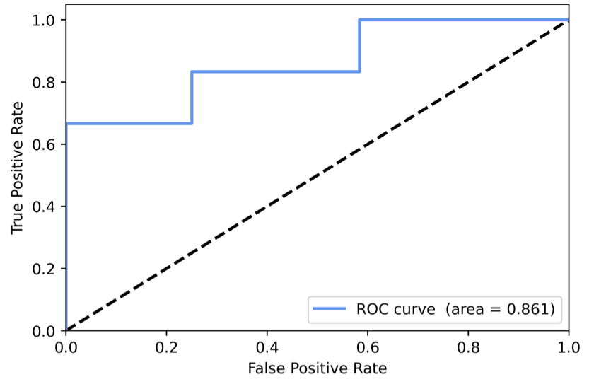

# 模型评价

由于所用数据集在分类上是倾斜的，故通过准确度对非平衡数据训练的模型进行评价不具合理性。因此选用ROC-AUC曲线图和F1-Score来评估模型的分类效果。

## F1-Score

F1分数是精确度和召回率的调和平均。通过计算每个分类的精确度和召回率，得出每个类别的F1分数值。F1分数在0和1之间，结果越接近1，分类效果越好，反之亦然。

$$F_1 = 2 \frac{precision\cdot recall }{precision+ recall} $$

- 高召回+高精度：模型完美学习了该类别
- 低召回+高精度：模型不能很好检测该类别，但一旦检测出，可信度非常高
- 高召回+低精度：模型可以很好地检测该类别，但同时也会包含属于其他类别的样本
- 低召回+低精度：模型不能处理该类别

由下表可知，无论是在ST还是非ST公司的分类下，f1-score分别达到0.80和0.92，说明模型成功学习了该类别。但ST公司的召回率只有0.67，表明模型不能很好检测该类别，可一旦检测出，可信度非常高。

**BP神经网络模型分类情况评价表：**

**Classification report of BPNN model**

|              | Precision | Recall | F1-score | Support |
| -----------: | --------: | -----: | -------: | ------: |
|       *ST/ST |      1.00 |   0.67 |     0.80 |       5 |
|       Normal |      0.86 |   1.00 |     0.92 |      12 |
|              |           |        |          |         |
|     Accuracy |           |        |     0.89 |      17 |
|    Macro avg |      0.93 |   0.83 |     0.86 |      17 |
| Weighted avg |      0.90 |   0.89 |     0.88 |      17 |

来源：python sklearn.metrics. classification_report

```python
from sklearn.metrics import classification_report

def CalcF1Scores(y_true, y_pred, labels, target_names):
    """
    Evaluete model by precision values, recall values, and F1-Scores. Print all of them
    :param y_true: ground truth (correct) target values
    :param y_pred: estimated targets as returned by a classifier
    :param labels: list of label indices to include in the report
    :param target_names: display names matching the labels (same order)
    :return: None
    """
    print(classification_report(y_true, y_pred, labels=labels, target_names=target_names))
```

## ROC-AUC曲线图

接受者操作特性曲线（Receiver Operating Characteristic Curve）通过使用不同的正例判定阈值，绘制真正例比率（*TPR*）-假正例比率（*FPR*）曲线图，以检测分类模型表现的优劣。其中，$TPR = \frac{TP}{TP+FN}$，$FPR = \frac{FP}{FP+TN}$。我们希望正确被预测为正例的概率偏大，而错误被预测为正例的概率偏小，即TPR更大，FPR更小，所以在ROC-AUC曲线图中，ROC曲线越靠近坐标轴左上角，代表曲线下面积的AUC值越大，模型的分类效果越佳。

如图，ROC曲线始终在黑色虚线上方，靠近坐标轴左上角，AUC值为0.861，表明模型的分类效果良好。

**BP神经网络模型的ROC-AUC曲线图：**

**ROC curve of BPNN model**

<div style="text-align: center; margin: 1rem;">
  
</div>

```python
from sklearn.metrics import roc_curve, roc_auc_score

def DrawROCGraph(y_true, y_pred_p, colors, label_names):
    """
    Draw ROC-AUC graph
    :param y_true: true labels
    :param y_pred_p: the probability that test samples belong to each class
    :param colors: the colors of ROC curves for each class
    :param label_names: names of labels (the same order as colors)
    :return: None
    """
    lw = 2
    plt.plot([0, 1], [0, 1], color='black', lw=lw, linestyle='--')
    for i in range(y_pred_p.shape[1]):
        scores = y_pred_p[:,i]
        fpr, tpr, thresholds = roc_curve(y_true, scores, pos_label=i)
        plt.plot(fpr,
                 tpr,
                 color=colors[i],
                 lw=lw,
                 label='ROC curve of %s (area = %.3f)' % (label_names[i], roc_auc_score(y_true==i, scores)))
    plt.xlim([0.0, 1.0])
    plt.ylim([0.0, 1.05])
    plt.xlabel('False Positive Rate')
    plt.ylabel('True Positive Rate')
    plt.title('Receiver operating characteristic')
    plt.legend(loc="lower right")
    plt.savefig('ROC', dpi=400, bbox_inches='tight')
    plt.show()
```