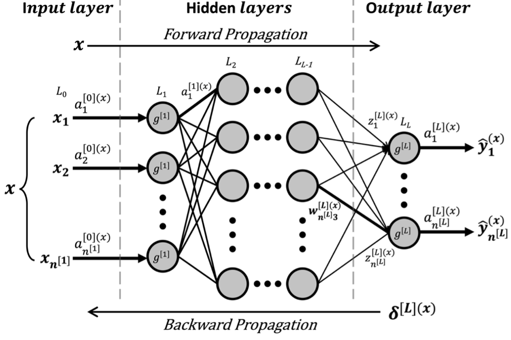

# BP神经网络

**神经网络（Neural Networks）**是一种基于层和节点单元的深度学习模型，其计算过程模拟生物大脑中神经元（Neurons）间信号的相互传递。一个节点相当于生物大脑中的突触，接收信号后进行处理，再将其发送给与之相连的神经元。神经网络的神经元被聚合成不同的层，每一层包含数个神经元节点，层与层的节点间通过边相连，通常这些边表示连接的权重。第一层和最后一层分别称为输入层和输出层，神经网络的信号传递就是从输入层向输出层传送的过程。

**BP神经网络（BP Neural Networks）**是一种基于误差反向传播算法（Back Propagation of Errors）的**多层前馈神经网络**，相关概念在七十年代被提出。1986年，在David E. Rumelhart等人的努力下[1]，使得BP算法成为神经网络学习的主流工具。在训练中，通过反复调整连接权重和偏差，使得神经网络输出和实际输出张量之间的误差达到最小，解决了以往权重无法计算的问题。多层神经网络和非线性激活函数实现了输入到输出的非线性映射，能够解决类似于财务危机预测等内部机制复杂的计算问题。

BP神经网络由输入层、隐藏层和输出层构成。其中，除输入层外，其他层均包含参数：激活函数$g$、权重$w$和偏移量$b$。训练样本的特征值从输入层输入模型，经隐藏层计算后，由输出层输出计算结果。同时，输出层产生一样本的学习误差$\delta$，该误差由输出层反向传播，从而由后一层计算出前一层的学习误差，在梯度下降（如SGD等）中使用误差不断更新每层的权重和偏移量。

## 符号说明

| 名称                        | 符号                                | 说明                                                         |
| --------------------------- | ----------------------------------- | ------------------------------------------------------------ |
| Superscript squared bracket | $[l]$                               | 神经网络第 $l$ 层                                            |
| Superscript round bracket   | $(x)$                               | $x$ 个训练样本产生值                                         |
| Capital L                   | $L$                                 | 神经网络总层数                                               |
| Neurones number             | $n^{[l]}$                           | $l$ 层节点数                                                 |
| Samples number              | $m$                                 | 样本数                                                       |
| Activation function         | $g$                                 | 某层的激活函数                                               |
| Output z                    | $z_{j}$                             | 某层 $j$ 个神经元输入                                        |
| Input a                     | $a_{k}$                             | 某层 $k$ 个神经元输出                                        |
| Bias                        | $b_j$                               | 某层 $j$ 个神经元偏移量                                      |
| Weight                      | $w^{ \left [ l \right ] }_{ jk }$   | $l$ 层 $k$ 个节点和 $l-1$ 层 $j$ 个节点的连接权重            |
| Y hat                       | $\hat{y}$                           | $L$ 层（输出层）输出张量                                     |
| Cost function               | $C$                                 | 总代价函数（对单个训练样本：$C^{(x)}$ ）                     |
| Delta                       | $\delta^{[l]}_j$                    | 定义中间量，$l$ 层 $j$ 个节点的误差                          |
| Nabla                       | $\nabla_{a^{ \left [ L \right ] }}$ | 梯度算子，( $\frac{\partial }{\partial a^{\left [ L \right ] }_1}, \frac{\partial }{\partial a^{\left [ L \right ] }_2}... \frac{\partial }{\partial a^{\left [ L \right ] }_{n^{\left [ L \right ] }}}$ ) |
| Learning rate               | $\alpha$                            | 学习率                                                       |

## 模型建立

  

### 前向传播（Forward Prop.）

$$z^{ \left [ l \right ] \left ( x \right ) }_j = \sum_{k} w^{ \left [ l \right ] }_{ jk } a^{ \left [ l-1 \right ] \left ( x \right ) }_{ k } + b^{ \left [ l \right ] }_{ j }$$

$$a^{\left [ l \right ] \left ( x \right ) }_{j} = g^{ \left [ l \right ] }\left ( z^{ \left [ l \right ] \left ( x \right ) }_j \right ) $$

使用紧凑的向量化形式重写上述表达式：

$$z^{ \left [ l \right ] \left ( x \right ) } = w^{ \left [ l \right ] } a^{ \left [ l-1 \right ] \left ( x \right ) } + b^{ \left [ l \right ] }$$

$$a^{ \left [ l \right ] \left ( x \right ) } = g^{ \left [ l \right ] } \left ( z^{ \left [ l \right ] \left ( x \right ) } \right )$$

### 代价函数（Cost Function）

$$C= \frac{1}{m} \sum\nolimits_{x} C^{ \left ( x \right ) } = \frac{1}{2m} \sum_{x=1}^{m} {\left \| y^{\left ( x \right )} - \hat{y}^{\left ( x \right ) }\right \| }^2$$

### 反向传播（Backward Prop.）

定义中间量，误差 $\delta$ 为：

$$\delta ^{ \left [ l \right ] \left ( x \right ) }_j = \frac{\partial C^{ \left ( x \right ) }}{\partial z^{ \left [ l \right ] }_j} $$

则可列出 $\partial b$ 和 $\partial w$ 的表达式，

$$\frac{\partial C^{ \left ( x \right ) }}{\partial b^{ \left [ l \right ] }_j} = \delta^{ \left [ l \right ] \left ( x \right ) }_j$$

$$\frac{\partial C^{\left ( x \right )}}{\partial w^{ \left [ l \right ] }_{jk}} = a^{ \left [ l-1 \right ] \left ( x \right ) }_k \delta^{ \left [ l \right ] \left ( x \right ) }_j$$

> $\partial b$, $\partial w$ 为代价函数$C$对$b$和$w$求导的简写，根据吴恩达的机器学习教程。

当 $l=L$ 时，由链式法则可得，$L$ 层误差为：

$$\delta ^{ \left [ L \right ] \left ( x \right ) }_j = \frac{\partial C^{\left ( x \right )}}{\partial a^{ \left [ L \right ] }_j} {g^{ \left [ L \right ] }}' \left ( z^{ \left [ L \right ] \left ( x \right ) }_j \right ) $$

使用紧凑的向量化形式重写上述表达式：

$$\nabla_{a^{ \left [ L \right ] }}C^{\left ( x \right )} = \sum_{j=1}^{n^{ \left [ L \right ] }} \vec{e_j} \frac{\partial C^{\left ( x \right )}}{\partial a^{\left [ L \right ] }_j} $$

$$\delta^{ \left [ L \right ] \left ( x \right ) } = \nabla_{a^{ \left [ L \right ] }}C^{\left ( x \right )} \circ {g^{ \left [ L \right ] }}' \left ( z^{ \left [ L \right ] \left ( x \right ) } \right ) = \left ( a^{ \left [ L \right ] \left ( x \right ) } - y^{\left ( x \right )} \right ) \circ {g^{ \left [ L \right ] }}' \left ( z^{ \left [ L \right ] \left ( x \right ) } \right )$$

> 运算符 $\circ$ 表示矩阵运算中的哈达玛积（Hadamard Product）

由 $l+1$ 层误差 $\delta^{l+1}$ 求 $l$ 层误差 $\delta^l$：

$$\delta^{ \left [ l \right ] \left ( x \right ) } = \left ( \left ( w^{ \left [ l+1 \right ] } \right )^T \delta^{ \left [ l+1 \right ] \left ( x \right ) } \right ) \circ {g^{ \left [ l \right ] }}' \left ( z^{ \left [ l \right ] \left ( x \right ) } \right )$$

由误差 $\delta$ 求模型参数的偏导数：

$$\frac{\partial C^{\left ( x \right )}}{\partial b^{ \left [ l \right ] }} = \delta^{ \left [ l \right ] \left ( x \right ) }$$

$$\frac{\partial C^{\left ( x \right )}}{\partial w^{ \left [ l \right ] }} = a^{ \left [ l-1 \right ] \left ( x \right ) } \delta^{ \left [ l \right ] \left ( x \right ) }$$

### 批梯度下降（BGD）

> 虽然在实际中使用的是Mini-Batch Gradient Decent，即 $m={m}'$，但这里以BGD为例。

$$w^{ \left [ l \right ] } = w^{ \left [ l \right ] } - \frac{\alpha}{m} \sum\nolimits_{x}\frac{\partial C^{\left ( x \right )}}{\partial w^{ \left [ l \right ] }} = w^{ \left [ l \right ] } - \frac{\alpha}{m} \sum\nolimits_{x} a^{ \left [ l-1 \right ] \left ( x \right ) } \delta^{ \left [ l \right ] \left ( x \right ) }$$

$$b^{ \left [ l \right ] } = b^{ \left [ l \right ] } - \frac{\alpha}{m} \sum\nolimits_{x}\frac{\partial C^{\left ( x \right )}}{\partial b^{ \left [ l \right ] }} = b^{ \left [ l \right ] } - \frac{\alpha}{m} \sum\nolimits_{x} \delta^{ \left [ l \right ] \left ( x \right ) }$$

---

[22] DE Rumelhart, Hinton G E , Williams R J . Learning Representations by Back Propagating Errors[J]. Nature, 1986, 323(6088):533-536.