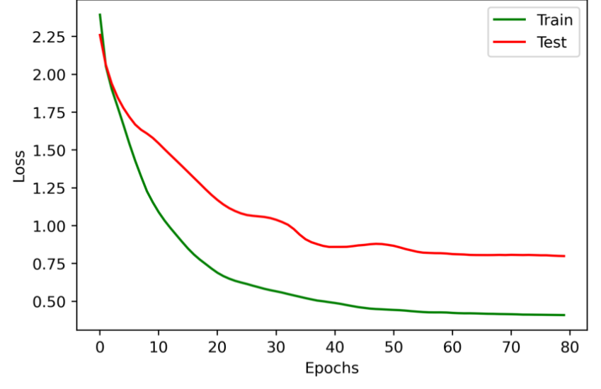

# 模型实现和优化

BP神经网络模型借助Python的**Keras**库进行搭建。定义神经网络总层数$L=5$，隐藏层所含神经元个数均为$n_{hidden}=7$，隐藏层激活函数均为双曲正切（Hyperbolic Tangent）。设置训练最大迭代次数为$epochs=80$，一次迭代的样本数为$batch\_size=all$，即所有样本。

因为研究的是多分类问题，所以设置BP神经网络输出层激活函数为softmax逻辑回归，从而输出所属分类的概率，损失函数为多分类交叉熵（Categorical Cross Entropy）。公式如下：

$$softmax\left ( z^{\left [ L \right ] } \right ) = a^{\left [ L \right ] } =\begin{bmatrix} \frac{e^{z^{\left [ L \right ] }_1}}{\sum\nolimits_{j} e^{z^{\left [ L \right ] }_j}} \\\frac{e^{z^{\left [ L \right ] }_2}}{\sum\nolimits_{j} e^{z^{\left [ L \right ] }_j}} \\\vdots  \\\frac{e^{z^{\left [ L \right ] }_{n_{class}}}}{\sum\nolimits_{j} e^{z^{\left [ L \right ] }_j}}\end{bmatrix}$$

$$Loss_{CCE} = - \frac{1}{m} \sum_{x} {\sum_{i=1}^{n_{class}}y_i^{\left ( x \right ) }\log{\hat{y}_i^{\left ( x \right ) } } }$$

其中，$n_{class}$ 表示种类的数目，在模型中，有 $n_{class} = n^{[L]}$。

> Softmax和Loss Function of Categorical Cross Entropy公式均基于Keras，不保证其他环境下也是如此！

为避免因对称性导致的梯度下降无法终止的问题 [3]，提升算法收敛速度，使用以0为中心、标准差为$\sqrt{2/n_{inputs}}$ 的截断高斯分布随机初始化权值 $w$，$n_{inputs}$ 是权值张量中的输入单位数量，偏差 $b$ 可直接初始化为 $0$. 为衰减部分权值带来的影响从而降低模型复杂度，提高模型的泛化能力和鲁棒性，通过添加L1和L2正则项进行优化，在Keras中，正则化因子l1和l2均默认为0.1，并由此确定惩罚系数。为提升模型梯度下降的训练速度，使用Momentum和RMSprop相结合的Adam优化算法 [4]，参数选用文献中的推荐值，即设定学习率为0.04，$\beta_1$ 为0.9，$\beta_2$ 为0.999。

完成模型编译和训练后，将训练误差可视化，确定训练误差收敛情况。接着，对测试集做出预测，得到分类结果`y_pred`和所属分类的概率`y_pred_p`。

- **Adam算法**是为数不多的，经证明适用于大部分神经网络的优化算法之一，基于Momentum和RMSprop。核心思想是通过移动平均（Moving Average），让梯度下降每次更新参数时都能保持上一次的“动量”，这种趋势加了速梯度下降过程，提高模型训练速度；
- ARIMA（Autoregressive Integrated Moving Average）差分整合移动平均自回归模型，是时间序列预测的分析方法之一。了解其有利于理解移动平均过程。

> [3] He K , Zhang X , Ren S , et al. Delving Deep into Rectifiers: Surpassing Human-Level Performance on ImageNet Classification[C]// CVPR. IEEE Computer Society, 2015. 
>
> [4] Kingma D , Ba J . Adam: A Method for Stochastic Optimization[J]. Computer Science, 2014.

编译模型，随着训练迭代次数的不断提升，损失逐渐减少，最终趋于平稳，模型训练损失变化表明模型各参数均已收敛。

<div style="text-align: center; margin: 1rem;">
  
</div>

```python
from tensorflow.keras.layers import Dense
from tensorflow.keras.optimizers import Adam
from tensorflow.keras.models import Sequential
from tensorflow.keras.regularizers import l1_l2
from tensorflow.keras.initializers import he_normal

def createBPNN(L, n_inputs, n_hidden, n_L, lr=0.001):
    """
    Initialize and compile a BPNN Model
    :param L: #Layers (the number of layers)
    :param n_inputs: #Features (the number of features for a sample)
    :param n_hidden: the number of units for each hidden layer
    :param n_L: the number of units for output layer
    :param lr: learning rate for the optimizer (Default: 0.001)
    :return: compiled BPNN Model
    """
    # BP-Neural Network Model Definition
    # Sequential groups a linear stack of layers
    BPNN = Sequential(name='BPNN')
    # Add an input layer with shape of (n_inputs,) to BPNN Model, as well as
    # the input layer and the first layer with n_inputs units,
    # L-3 hidden layers from 2 to L-1 with n_hidden units each layer,
    # and an output layer with n_L units.
    Dense_Attr = {
    'use_bias': True,
    'kernel_initializer': he_normal(seed=917),
    'bias_initializer': 'zeros',
    'kernel_regularizer': l1_l2(l1=0.01, l2=0.01)
    }
    BPNN.add(Dense(units=n_inputs, input_shape=(n_inputs,), 
                   activation='tanh', 
                   **Dense_Attr, 
                   name='Layer1'))
    for i in range(2, L):
        BPNN.add(Dense(units=n_hidden, 
                       activation='tanh', 
                       **Dense_Attr, 
                       name='Layer'+str(i)))
    BPNN.add(Dense(units=n_L, 
                   activation='softmax', 
                   **Dense_Attr, 
                   name='Output_layer'))
    BPNN.compile(optimizer=Adam(lr=lr, beta_1=0.9, beta_2=0.999), 
                 loss='categorical_crossentropy')
    return BPNN
```

```python
from matplotlib import pyplot as plt

def fitModel(BPNN, batch_size, epochs, **dataset):
    """
    Fit BPNN model, visualize training history, and predict the test samples
    :param BPNN: model class
    :param batch_size: size of a batch
    :param epochs: number of training iterations
    :param dataset: include X_train, X_test, y_train_encoded, and y_test_encoded
    :return: tuple of (the probability that test samples belong to each class, the result of classification)
    """
    # Fit BPNN Model
    history = BPNN.fit(x=dataset['X_train'],
                       y=dataset['y_train_encoded'],
                       batch_size=batch_size,
                       epochs=epochs,
                       validation_data=(dataset['X_test'], dataset['y_test_encoded']),
                       verbose=0,
                       shuffle=True)
    # Visualize training history
    plt.plot(history.history['loss'], color='g', label='Train')
    plt.plot(history.history['val_loss'], color='r', label='Test')
    plt.title('Model loss')
    plt.xlabel('Epochs')
    plt.ylabel('Loss')
    plt.legend()
    plt.savefig('Model loss', dpi=400, bbox_inches='tight')
    plt.show()
    # Output the probability that test samples belong to each class
    # Array of float, shape of (n_samples, n_classes)
    y_pred_p = BPNN.predict(dataset['X_test'])
    # Output the result of classification
    y_pred = [np.argmax(y_pred_p[i]) for i in range(y_pred_p.shape[0])]
    return y_pred_p, y_pred
```

